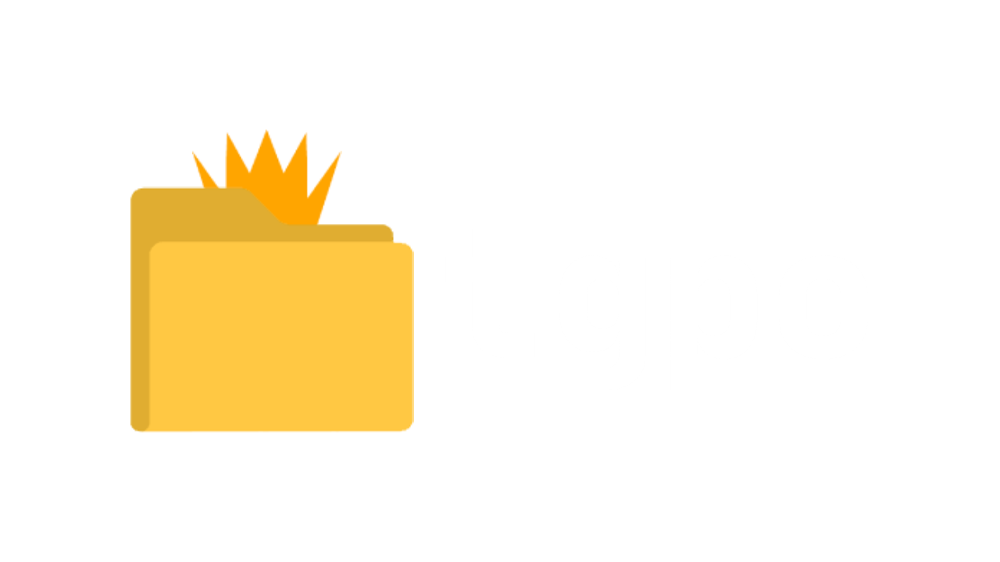

<h1 align="center">

</h1><br>
TGPC is a C++ command-line tool to quickly scaffold code projects using templates.

## Features
- Quickly create projects
- Compile/Run them

## Project Status
TGPC currently lacks lots of his barebones features, as it's still in development:
- Windows support
- Additional language support

New features will be added in future releases

## Installation
First clone the repository's *main* branch and then install using the makefile:
```bash
git clone https://github.com/ReduxTheCoder/tgpc
cd tgpc
make install
```
> **Note**: please don't expect the *debug* branch to always work, as it's highly unstable, and the program could not work correctly
> **Note**: the makefile automatically assumes that `~/.local/bin` is in your path, as it installs the program there, if you wish to move the binary in another directory,
> use `make release && mv bin/tgpc [DIR_PATH]`

Optionally you can remove the cloned repository:
```bash
cd ..
rm -r tgpc
```

You can also directly download the binary from our releases, and move it in your PATH variable

## Quick start
to display a help message that shows all commands:
```bash
tgpc help
```

to create a project with a name and a language:
```bash
tgpc new "my-project" "py"
```

## Language Support
here's a table showing supported languages and their respective name to use:
| Language   | tgpc |
| ---------- | ---- |
| Python     | py   |
| C          | c    |
| C++        | cpp  |
| Java       | java |
| Rust       | rs   |
| JavaScript | js   |
| TypeScript | ts   |
| Ruby       | rb   |
| Golang     | go   |
| PHP        | php  |

## OS Support
Currently, TGPC supports:
- Linux

Windows support may be added in a future release
